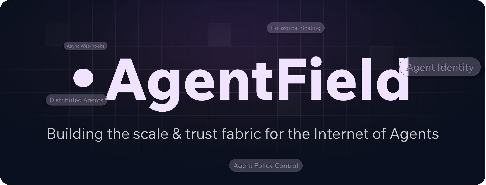

  
Everything shifts when **AI becomes native to the stack**.
We are shaping the future of how AI interacts with the digital world.

Open source control plane for autonomous software, where AI agents run as a governed digital workforce instead of loose scripts.

[🌐 Website](https://agentfield.ai) • [📚 Docs](https://agentfield.ai/docs) • [⭐ Main repo](https://github.com/Agent-Field/agentfield)

---

## Why this org exists

Software is moving from **deterministic backends** to **autonomous backends**.

Not just chatbots at the edge, but **digital workers in the core**:
AI that read ledgers, move money, reorder stock, rotate credentials, coordinate across vendors and spawn other agents. One support ticket or trade or incident can turn into hundreds of autonomous API calls in the background.

At that point you are not just managing users or services.
You are managing a **digital workforce** that operates at machine speed inside your stack.

We believe that world needs three things:

1. **Agents as first-class actors**
   Each agent should have an identity, a role and real accountability, not just an API key.

2. **Cryptographic provenance instead of vibes**
   Important actions should come with receipts that can be verified, not just logs that can be edited.

3. **Infrastructure that treats autonomy as a primitive**
   Queues, webhooks, discovery, policies and observability that assume agents will think, fan out and coordinate behind the scenes.

AgentField is where we build that stack in the open.

---

## What lives here

This org is the home for:

- **`agentfield`**
  The open source control plane that runs AI agents like microservices, with queues, async webhooks, discovery, identity and audit in one binary.

- **SDKs and examples**
  Thin SDKs that let you write plain Python (and other languages over time) while the control plane handles the hard parts: long-running work, streaming notes, multi-agent calls, verifiable credentials.

- **Specs, playbooks and experiments**
  Reference designs for autonomous backends, IAM patterns for agents, and example workflows that show what a real agent economy looks like in production.

If you want to understand where agent infrastructure is going, watching this org will tell you more than any single blog post.

---

## How to plug in early

You can treat this org in three ways:

1. **As a signal**
   - Star [`agentfield`](https://github.com/Agent-Field/agentfield) if you believe agents should be treated like governed microservices, not one-off scripts.
   - Watching this org is an easy way to track how the Internet of Agents stack is actually evolving.

2. **As a lab**
   - Use the examples to prototype serious use cases: refunds, treasury flows, claim handling, compliance checks, research workflows.
   - Stress test the control plane with the kind of multi-agent fan-out you cannot safely run through a single monolith.

3. **As infrastructure**
   - Drop the binary next to your stack, point agents at it, and let it handle identity, queues, audit and routing so you do not have to keep reinventing the same plumbing.

---

## A short vision for the Internet of Agents

We are optimistic about a near future where:

- Every meaningful workflow has a **fleet of agents** coordinating behind the scenes as an autonomous backend.
- Every agent carries **cryptographic proof** of who it is and what it is allowed to do.
- Every critical decision leaves a **verifiable trail**, so regulators, risk teams and customers can trust autonomous systems without having to trust any single vendor.

If that is the kind of future you are building toward, you are in the right org.

---

## Stay close

- ⭐ Star the core: [github.com/Agent-Field/agentfield](https://github.com/Agent-Field/agentfield)
- 🔔 Watch this org for new SDKs, examples and specs
- 💬 Open a discussion or issue if you are running agents in production and want to compare notes

This is infrastructure, but more importantly it is a bet on how the AI economy will run once AI is truly native to the stack.
