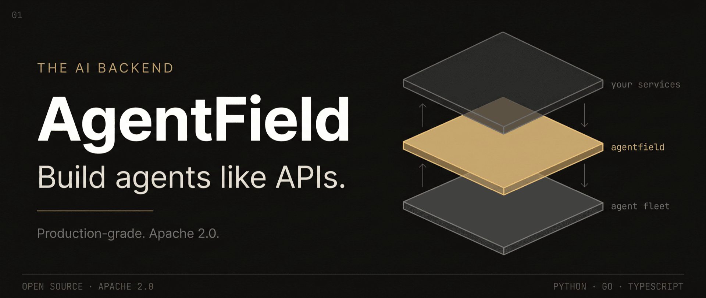

**Build agents like services. Scale them beyond chatbots** — the AI Backend for production agents. Write Python, Go, or TypeScript and get callable REST APIs, async execution, memory, discovery, observability, identity, and verifiable audit, built in.

[**⭐ Star AgentField**](https://github.com/Agent-Field/agentfield) · [Docs](https://agentfield.ai/docs) · [Website](https://agentfield.ai) · [Discord](https://discord.gg/aBHaXMkpqh)

---

## Built on AgentField

Production-grade autonomous agents. Apache 2.0. Each independently deployable.

| Project | What it does |
|---|---|
| **[SWE-AF](https://github.com/Agent-Field/SWE-AF)** | Autonomous engineering backend — hundreds of agents plan, code, test, and ship from one API call |
| **[sec-af](https://github.com/Agent-Field/sec-af)** | Autonomous security-audit backend — agents prove exploitability with traces and evidence, no analyst in the loop |
| **[plandb](https://github.com/Agent-Field/plandb)** | Agent-native issue tracker — backend that Claude Code, Codex, and other agents call directly (no human UI required) |
| **[af-deep-research](https://github.com/Agent-Field/af-deep-research)** | Autonomous research backend — agents fan out, recurse, and self-correct without human direction |
| **[person-to-brief-af](https://github.com/Agent-Field/person-to-brief-af)** | Adaptive person-intelligence backend — resolves identities, verifies public professional claims, and produces cited outreach briefs and PDFs from a name and company |
| **[reels-af](https://github.com/Agent-Field/reels-af)** | Background video pipeline — multi-agent backend ships viral reels / TikToks at ~$0.10 each, lights-out |
| **[pr-af](https://github.com/Agent-Field/pr-af)** | Autonomous PR-review backend — agents triage every pull request before a human ever opens it |
| **[af-reactive-atlas-mongodb](https://github.com/Agent-Field/af-reactive-atlas-mongodb)** | Background MongoDB enrichment — agents watch any collection and add an AI intelligence layer as documents arrive |
| **[cloudsecurity-af](https://github.com/Agent-Field/cloudsecurity-af)** | Autonomous IaC scanner — agents reason about attack paths in the background, no analyst review required |
| **[roboscribe-af](https://github.com/Agent-Field/roboscribe-af)** | Autonomous dataset annotator — agent swarm labels LeRobot demos without human raters |

All run on **[agentfield](https://github.com/Agent-Field/agentfield)** — one binary handling identity, queues, discovery, audit, and routing.

**[See all examples on agentfield.ai →](https://www.agentfield.ai/examples)**

---

## Why this org exists

Software is moving from **deterministic backends** to **autonomous backends** — fleets of agents reading ledgers, moving money, rotating credentials, coordinating across vendors. That world needs three things AgentField provides:

- **Agents as first-class actors** — cryptographic identity per agent, not API keys
- **Verifiable provenance** — every decision signs an audit trail you can verify offline
- **Autonomy as a primitive** — queues, webhooks, discovery, policy built into the runtime

[How AgentField compares to LangChain, CrewAI, Temporal →](https://agentfield.ai/docs/learn/vs-frameworks)
