

**Build agents like services. Scale them beyond chatbots** — the AI Backend for production agents. Write Python, Go, or TypeScript and get callable REST APIs, async execution, memory, discovery, observability, identity, and verifiable audit, built in.

[**⭐ Star AgentField**](https://github.com/Agent-Field/agentfield) · [Docs](https://agentfield.ai/docs) · [Website](https://agentfield.ai) · [Discord](https://discord.gg/aBHaXMkpqh)

---

## Applications built on AgentField

Production-grade, open-source autonomous systems. Each is independently deployable. Select an icon to open its repository.

### Software engineering

<table>
  <tr>
    <td align="center" width="33%">
      <a href="https://github.com/Agent-Field/SWE-AF">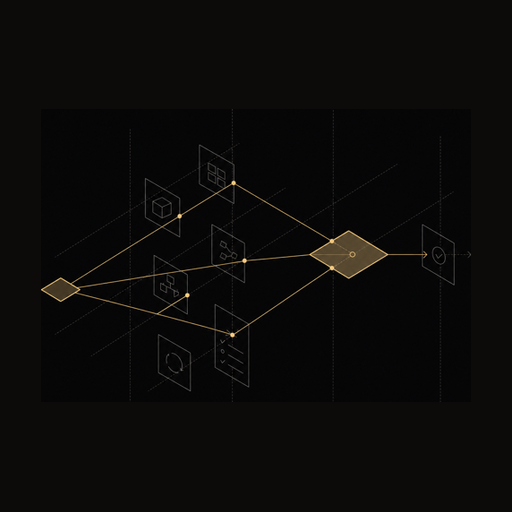</a>
    </td>
    <td align="center" width="33%">
      <a href="https://github.com/Agent-Field/pr-af">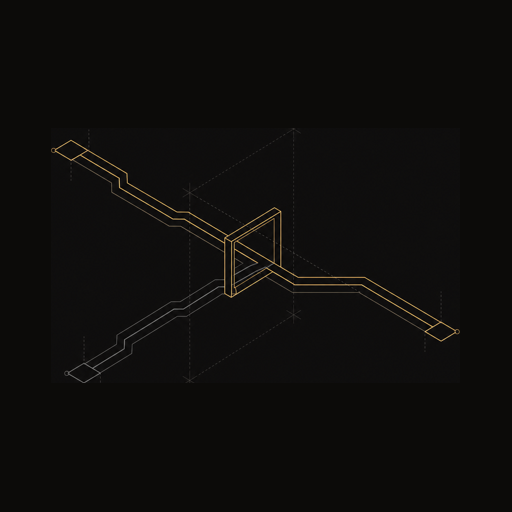</a>
    </td>
    <td align="center" width="33%">
      <a href="https://github.com/Agent-Field/sec-af">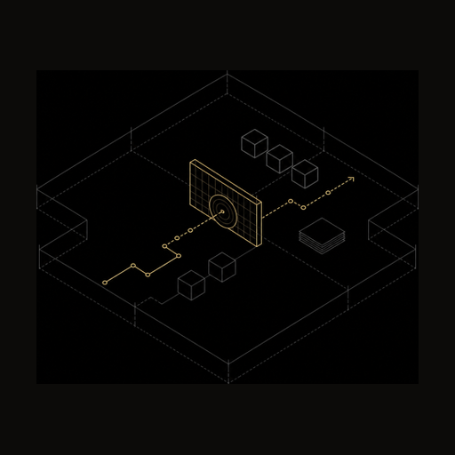</a>
    </td>
  </tr>
  <tr>
    <td align="center"><b>Autonomous engineering</b></td>
    <td align="center"><b>Code review</b></td>
    <td align="center"><b>Application security audit</b></td>
  </tr>
  <tr>
    <td align="center">Plan, build, and ship code.</td>
    <td align="center">Catch high-signal changes.</td>
    <td align="center">Trace exploitable risks.</td>
  </tr>
  <tr>
    <td align="center" width="33%">
      <a href="https://github.com/Agent-Field/cloudsecurity-af">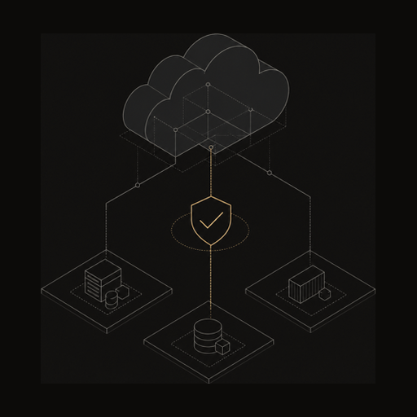</a>
    </td>
    <td align="center" width="33%">
      <a href="https://github.com/Agent-Field/plandb">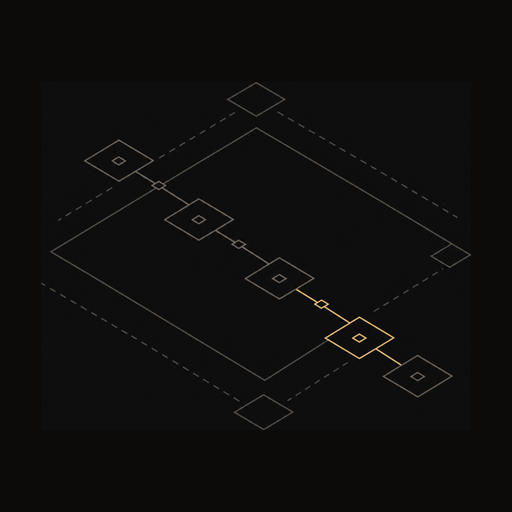</a>
    </td>
    <td align="center" width="33%">
      <a href="https://github.com/Agent-Field/furrow">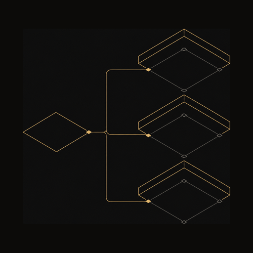</a>
    </td>
  </tr>
  <tr>
    <td align="center"><b>Cloud infrastructure security</b></td>
    <td align="center"><b>Agent work planning</b></td>
    <td align="center"><b>Parallel agent workspaces</b></td>
  </tr>
  <tr>
    <td align="center">Map IaC attack paths.</td>
    <td align="center">Direct parallel agent work.</td>
    <td align="center">Fork isolated workspaces.</td>
  </tr>
</table>

### Intelligence & data

<table>
  <tr>
    <td align="center" width="33%"><a href="https://github.com/Agent-Field/ragpack-af">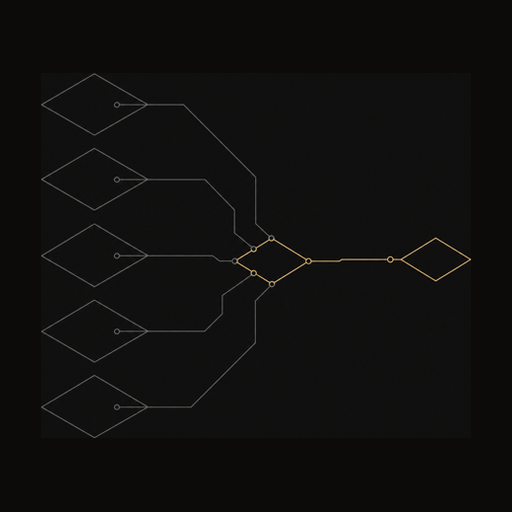</a></td>
    <td align="center" width="33%"><a href="https://github.com/Agent-Field/af-deep-research">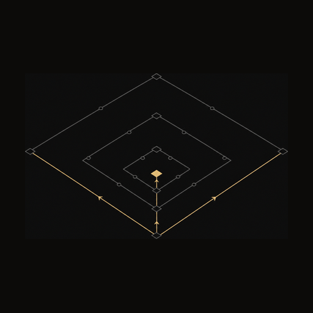</a></td>
    <td align="center" width="33%"><a href="https://github.com/Agent-Field/af-reactive-atlas-mongodb">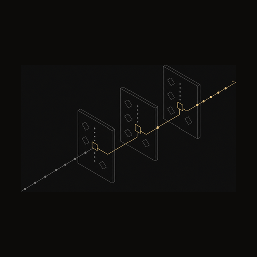</a></td>
  </tr>
  <tr>
    <td align="center"><b>Evidence-backed document research</b></td>
    <td align="center"><b>Recursive deep research</b></td>
    <td align="center"><b>Real-time document intelligence</b></td>
  </tr>
  <tr>
    <td align="center">Cite evidence from messy files.</td>
    <td align="center">Keep researching until gaps close.</td>
    <td align="center">Enrich records on change.</td>
  </tr>
</table>

### Specialized workflows

<table>
  <tr>
    <td align="center" width="33%"><a href="https://github.com/Agent-Field/contract-af">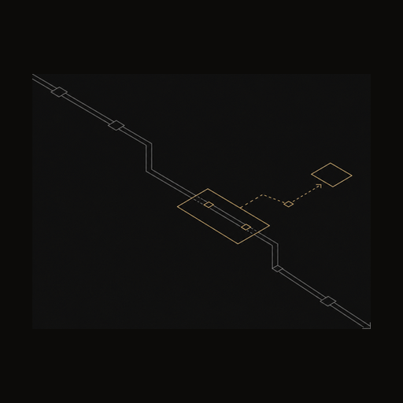</a></td>
    <td align="center" width="33%"><a href="https://github.com/Agent-Field/reels-af">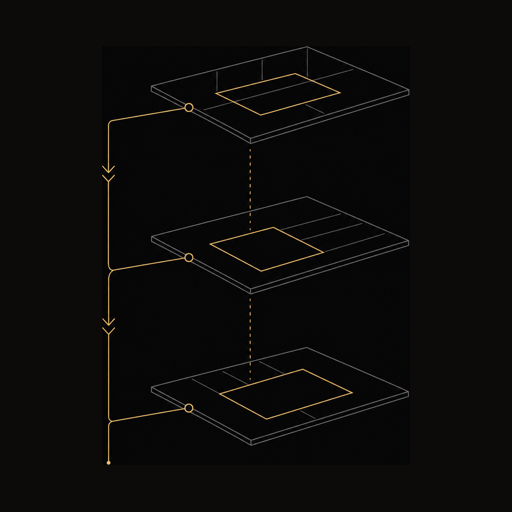</a></td>
    <td align="center" width="33%"><a href="https://github.com/Agent-Field/roboscribe-af">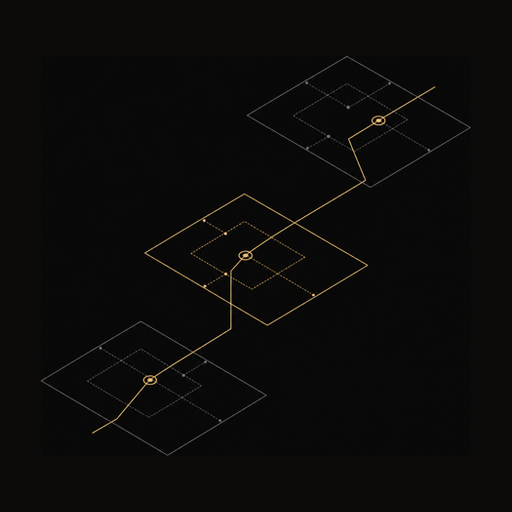</a></td>
  </tr>
  <tr>
    <td align="center"><b>Contract risk analysis</b></td>
    <td align="center"><b>Short-form video production</b></td>
    <td align="center"><b>Robotics dataset annotation</b></td>
  </tr>
  <tr>
    <td align="center">Spot contract risks early.</td>
    <td align="center">Make finished short videos.</td>
    <td align="center">Label robot demonstrations.</td>
  </tr>
</table>

All applications run on **[AgentField](https://github.com/Agent-Field/agentfield)** — one binary for identity, queues, discovery, audit, and routing.

**[See all examples on agentfield.ai →](https://www.agentfield.ai/examples)**

---

## Why this org exists

Software is moving from **deterministic backends** to **autonomous backends** — fleets of agents reading ledgers, moving money, rotating credentials, coordinating across vendors. That world needs three things AgentField provides:

- **Agents as first-class actors** — cryptographic identity per agent, not API keys
- **Verifiable provenance** — every decision signs an audit trail you can verify offline
- **Autonomy as a primitive** — queues, webhooks, discovery, policy built into the runtime

[How AgentField compares to LangChain, CrewAI, Temporal →](https://agentfield.ai/docs/learn/vs-frameworks)
